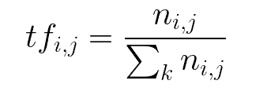
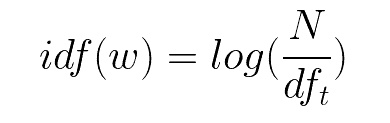
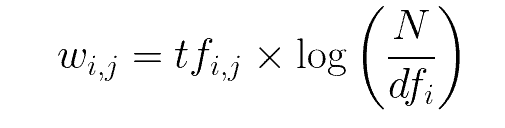

# Transforming Text Data to a form a Machine Learning Model Understands

- Since ML models doesn't understand textual data we need a way to convert the data we obtain after cleaning the text data into some numeric form so that it can be fed into the model so that it can perform some form of computations on it.

we can use 2 main tools

1. CountVectorizer
2. TF-IDF

Advanced:
(These are techniques are unsupervised learning techniques. They help us learn representation for text where words that have the same meaning have a similar representation)

- Word2Vec
- Glove
- Simple Embedding Layer

## 1. CountVectorizer

- CountVectorizer is a great feature extraction tool provided by sklearn.
- It's basic purpose is that it **converts a given text into a vector-based on the count(frequency) of the occurence of each word in a list.**
- It creates a sparse matrix of the count of the numbers.
  `from sklearn.feature_extraction.text import CountVectorizer`

- we'll need to get the whole data into the CountVectorizer sparse matrix
  - **But before we feed that, we'll have to pass the whole dataset through the preprocessing function.**
  - luckily CountVectorizer gives us this option
  - `bow = CountVectorizer(analyzer=preprocess)`

## 2. TF-IDF(Term-Frequency times Inverse Document-Frequency)

### Math related to TF-IDF

- Term-Frequency refers to the frequency of appearance of a word divided by the total number of words in the document
  <!-- doing `!` will render it, otherwise it'll just be a link -->



- IDF means inverse document frequency which is computed via a log of the number of documents that contain the word `w`
- It determines the **weight of the rare words across all documents in the corpus**.
  

> - A document (This concept can be a bit vague in NLP) is a unit, so it can correspond to different text objects, such as entire documents, sentences, passages, etc.
> - A corpus is a collection of documents

- TF-IDF is simply the product of Term Frequency and Inverse Document Frequency
  

### Sklearn has it already implemented

```py
from sklearn.feature_extraction.text import TfidfTransformer
tfidf = TfidfTransformer()
```
